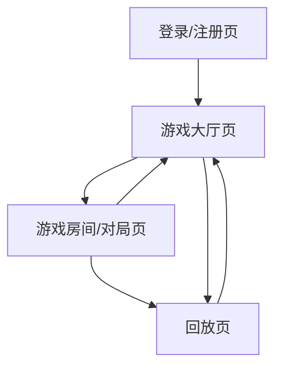

## 1. Product Overview
狼人杀网页版是一款支持多人实时对局的在线狼人杀游戏。
你可以创建/加入房间进行对局，并在对局结束后查看回放。

## 2. Core Features

### 2.1 User Roles
| Role | Registration Method | Core Permissions |
|------|---------------------|------------------|
| 未登录访客 | 无需注册 | 仅可查看登录/注册入口；不可创建/加入对局；不可查看个人回放 |
| 已登录玩家 | 邮箱/用户名+密码注册与登录 | 创建/加入房间、参与游戏、查看个人回放 |
| 房主 | 在房间内创建者自动获得 | 配置房间、开始游戏、解散房间 |

### 2.2 Feature Module
本产品最小可用版本包含以下页面：
1. **登录/注册页**：账号注册、登录、基础校验与错误提示。
2. **游戏大厅页**：创建房间、房间列表与快速加入、个人入口（回放）。
3. **游戏房间/对局页**：房间成员、准备/开局、实时游戏交互（发言/投票/夜晚动作）、结果结算。
4. **回放页**：回放列表、回放详情（按时间线还原对局事件）。

### 2.3 Page Details
| Page Name | Module Name | Feature description |
|-----------|-------------|---------------------|
| 登录/注册页 | 注册 | 创建账号（邮箱/用户名、密码）；校验必填与格式；提示失败原因 |
| 登录/注册页 | 登录 | 登录并获取会话；提示账号/密码错误；支持退出登录 |
| 游戏大厅页 | 顶部栏 | 显示产品名与当前用户状态；提供“回放”“退出登录”入口 |
| 游戏大厅页 | 创建房间 | 输入房间名/基础设置；创建成功后自动进入房间 |
| 游戏大厅页 | 房间列表/加入 | 展示可加入房间的基础信息；支持加入房间；加入失败给出原因（满员/已开局等） |
| 游戏房间/对局页 | 房间等待区 | 展示玩家列表与席位状态；玩家准备/取消准备；房主开始游戏；房主解散房间 |
| 游戏房间/对局页 | 实时对局 | 在单一页面内完成主要交互：阶段提示（白天/夜晚/投票等）、发言区/倒计时、投票与夜晚技能操作、系统事件通知 |
| 游戏房间/对局页 | 结算 | 展示胜负与关键事件摘要；提供“返回大厅”“查看回放”入口 |
| 回放页 | 回放列表 | 展示你的历史对局（时间、房间名、结果）；可筛选/分页（最小可用可仅分页） |
| 回放页 | 回放详情 | 以时间线方式回看事件（阶段、发言、投票、死亡/技能等）；支持快进到下一阶段/关键事件 |

## 3. Core Process
**玩家流程**：你在登录/注册后进入游戏大厅，选择创建房间或加入房间；在房间等待区准备就绪；进入对局后按阶段进行发言、投票与夜晚动作；对局结束后查看结算，并可进入回放页查看该局回放或在大厅进入回放列表。

**房主流程**：你在大厅创建房间后进入等待区；根据房间内玩家准备状态决定开始游戏；如需要可解散房间；对局结束后同样可查看结算与回放。

