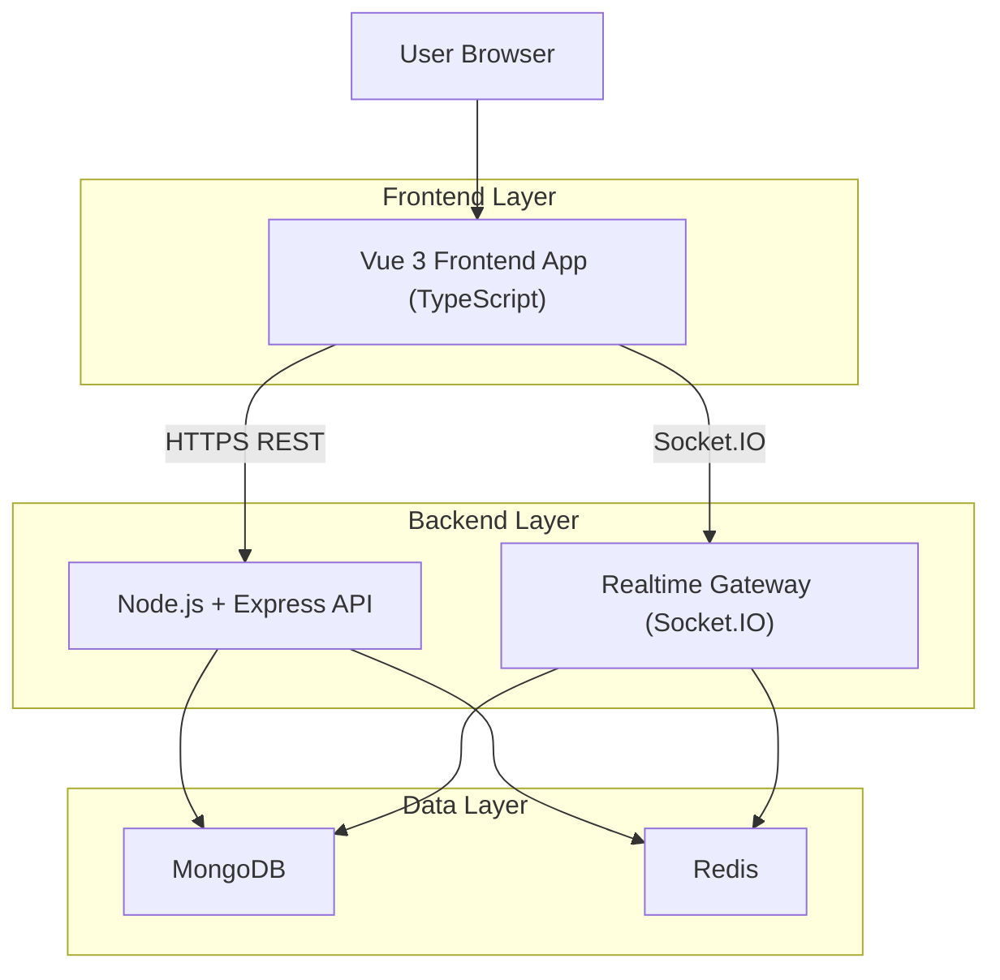
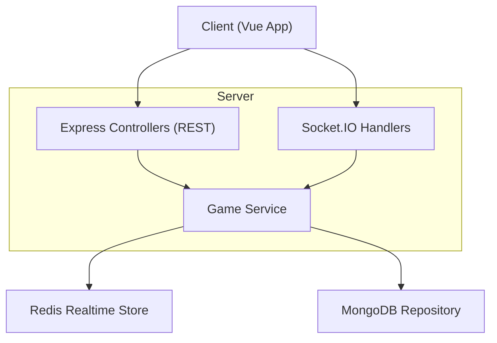

## 1.Architecture design


## 2.Technology Description
- Frontend: Vue@3 + TypeScript + Vite + Pinia + Vue Router
- Backend: Node.js + Express@4 + Socket.IO
- Database: MongoDB
- Cache/Realtime State: Redis

## 3.Route definitions
| Route | Purpose |
|-------|---------|
| /auth | 登录/注册页面，获取与刷新会话 |
| /lobby | 游戏大厅：创建/加入房间、房间列表、进入回放 |
| /room/:roomId | 房间等待区与对局页面（同页覆盖等待→进行中→结算） |
| /replays | 回放列表与回放详情入口 |
| /replays/:replayId | 回放详情：按时间线还原事件 |

## 4.API definitions (If it includes backend services)
### 4.1 TypeScript shared types（前后端共享）
```ts
export type UserId = string;
export type RoomId = string;
export type GameId = string;
export type ReplayId = string;

export type RoomStatus = "waiting" | "playing" | "ended";
export type Phase = "night" | "day_speech" | "day_vote" | "settlement";

export interface UserPublic {
  id: UserId;
  nickname: string;
}

export interface RoomSummary {
  id: RoomId;
  name: string;
  status: RoomStatus;
  playerCount: number;
  maxPlayers: number;
}

export type ReplayEventType =
  | "phase_changed"
  | "chat_message"
  | "vote_cast"
  | "player_eliminated"
  | "game_result";

export interface ReplayEvent {
  t: number; // ms since game start
  type: ReplayEventType;
  payload: Record<string, unknown>;
}

export interface ReplayRecord {
  id: ReplayId;
  gameId: GameId;
  roomId: RoomId;
  createdAt: string;
  resultSummary: string;
}
```

### 4.2 REST API（示例最小集合）
认证（账号）
- `POST /api/auth/register`
- `POST /api/auth/login`
- `POST /api/auth/logout`
- `GET /api/me`

大厅/房间
- `GET /api/rooms`（房间列表）
- `POST /api/rooms`（创建房间）
- `POST /api/rooms/:roomId/join`（加入房间）
- `POST /api/rooms/:roomId/leave`（离开房间）

回放
- `GET /api/replays`（当前用户回放列表）
- `GET /api/replays/:replayId`（回放详情：事件流/元数据）

### 4.3 Socket.IO events（示例最小集合）
Client -> Server
- `room:join` `{ roomId }`
- `room:ready` `{ roomId, ready: boolean }`
- `game:action` `{ roomId, actionType, payload }`（投票/夜晚动作等）
- `chat:send` `{ roomId, text }`

Server -> Client
- `room:state` `{ room }`（等待区成员/准备状态/房主等）
- `game:state` `{ phase, timers, publicLog, playersPublicState }`
- `game:private` `{ hints }`（仅本人可见信息）
- `chat:new` `{ sender, text, at }`
- `game:ended` `{ resultSummary, replayId }`

## 5.Server architecture diagram (If it includes backend services)


## 6.Data model(if applicable)
### 6.1 Data model definition（MongoDB Collections）
- users
  - `_id`, `emailOrUsername`, `passwordHash`, `nickname`, `createdAt`, `lastLoginAt`
- rooms
  - `_id`, `name`, `ownerUserId`, `status`, `maxPlayers`, `createdAt`
- games
  - `_id`, `roomId`, `status`, `startedAt`, `endedAt`, `resultSummary`, `playersSnapshot`（开局快照）
- replays
  - `_id`, `gameId`, `roomId`, `ownerUserIds`（参与者 userId 列表，用于权限校验）
  - `createdAt`, `durationMs`, `events: ReplayEvent[]`

说明：Redis 用于存储“房间实时状态/倒计时/在线成员/阶段推进中的临时数据”，MongoDB 存储“账号、房间与对局持久化记录、回放事件流”。

### 6.2 Data Definition Language
MongoDB 建表示例（索引为关键）：
```js
// users
db.users.createIndex({ emailOrUsername: 1 }, { unique: true });

// rooms
db.rooms.createIndex({ status: 1, createdAt: -1 });

// games
db.games.createIndex({ roomId: 1, startedAt: -1 });

// replays
db.replays.createIndex({ ownerUserIds: 1, createdAt: -1 });
db.replays.createIndex({ gameId: 1 }, { unique: true });
```
